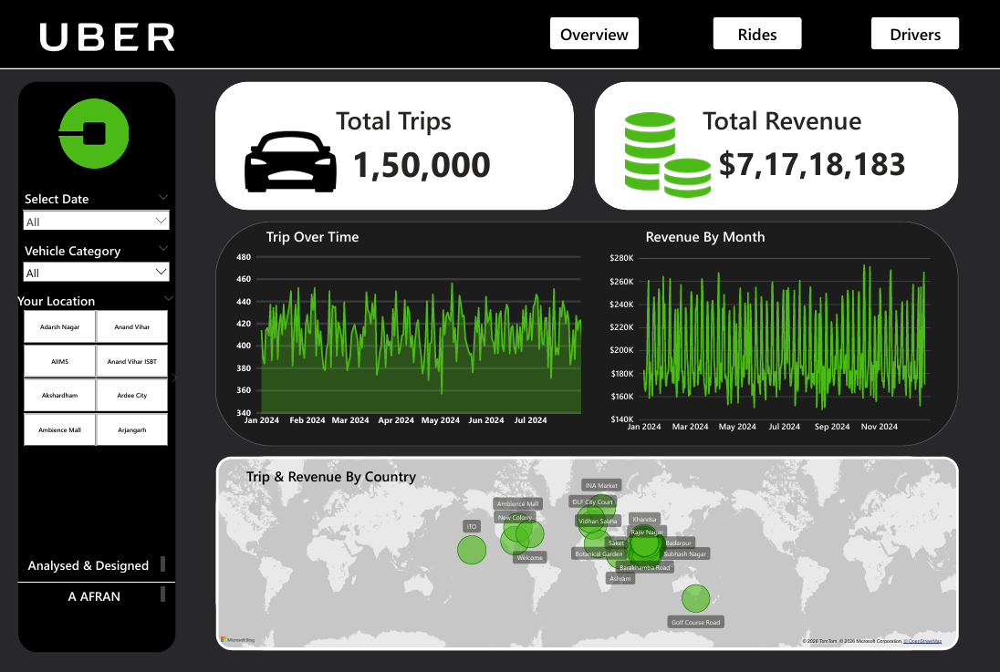
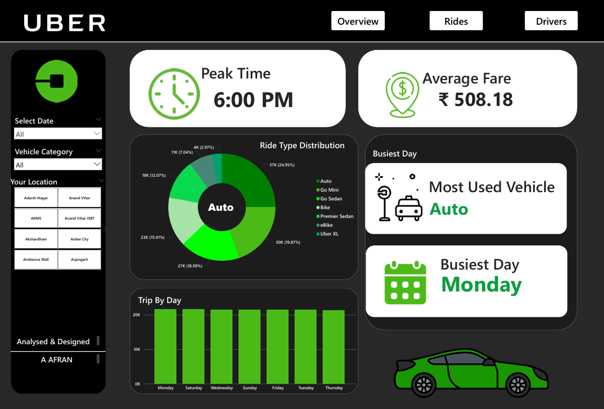
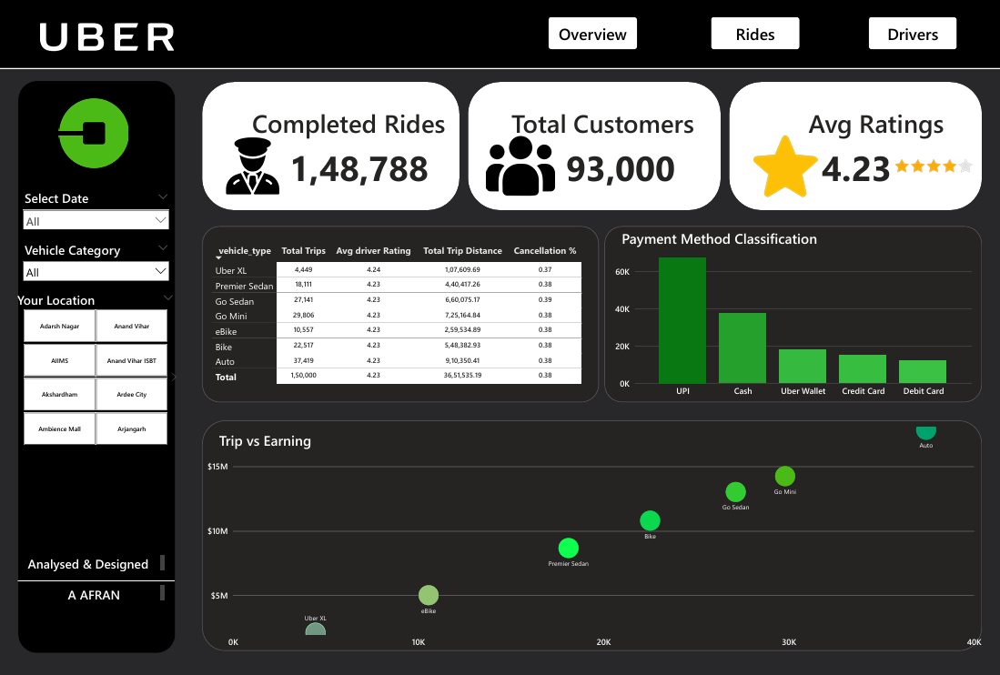

# 🚖 Uber Data Analytics Dashboard

## 📌 Project Overview
This project presents an end-to-end Uber analytics dashboard built using Power BI. It provides insights into trip performance, revenue trends, customer behavior, and driver analytics.

---

## 🔧 Tools & Technologies
- Power BI  
- Python (Pandas, Jupyter Notebook)  
- Power Query  
- CSV Dataset  

---

## 🧹 Data Preparation
- Raw dataset processed using Python (handled missing values, duplicates, and formatting issues)  
- Cleaned dataset exported as CSV  
- Further transformation and modeling performed in Power BI using Power Query  

---

## 📊 Dashboard Features

### 📍 Overview Dashboard
- Total Trips and Total Revenue KPIs  
- Monthly and daily trip trends  
- Revenue analysis  
- Geographic distribution of trips  

### 🚗 Rides Dashboard
- Peak time analysis  
- Average fare insights  
- Ride type distribution  
- Busiest day and most used vehicle  

### 👨‍✈️ Drivers Dashboard
- Driver performance metrics  
- Ratings analysis  
- Payment method insights  
- Trip vs earnings relationship  

---

## 📷 Dashboard Preview

### 🔹 Overview

### 🔹 Rides

### 🔹 Drivers

---

## 🚀 How to Use
1. Download the `.pbix` file from the `dashboard` folder  
2. Open it using Power BI Desktop  
3. Explore the interactive dashboards using filters and slicers  

---

## 📁 Project Structure

uber-powerbi-dashboard/
│
├── data/
├── notebooks/
├── dashboard/
├── images/
└── README.md

---

## 🔗 GitHub Repository
https://github.com/Afran-dataviz/uber-powerbi-dashboard

---

## 👤 Author
**A Afran**
